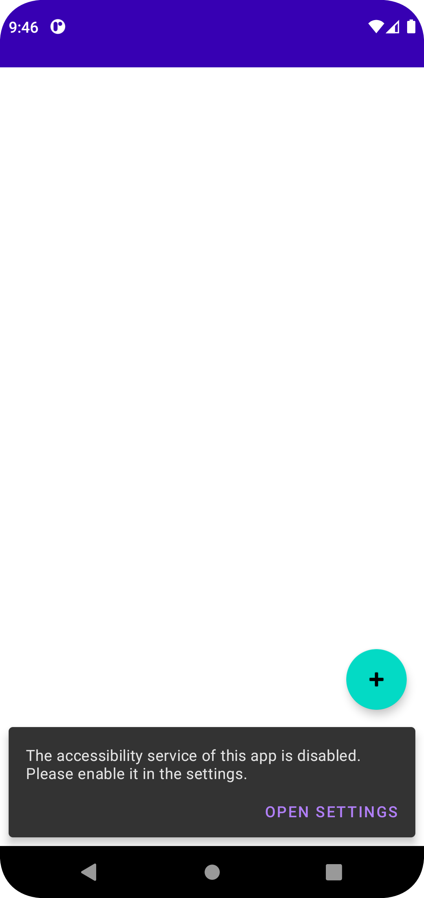
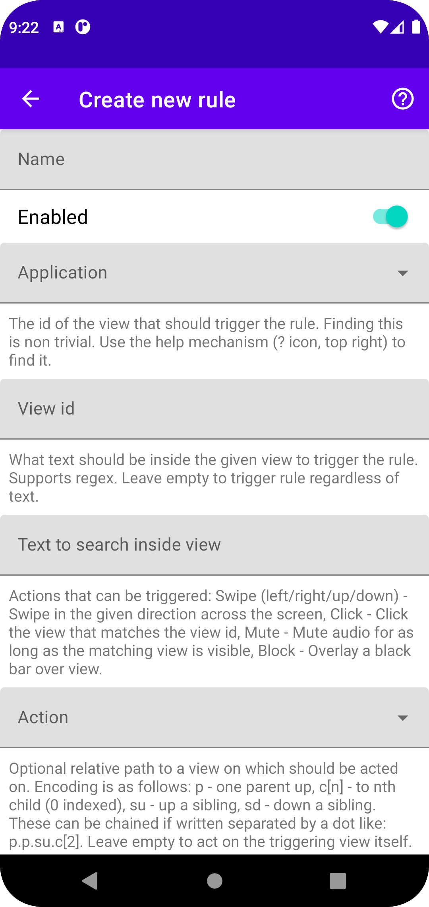
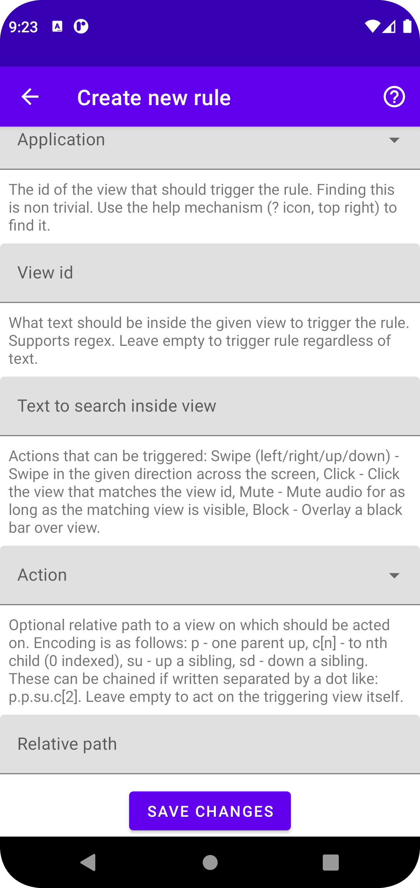
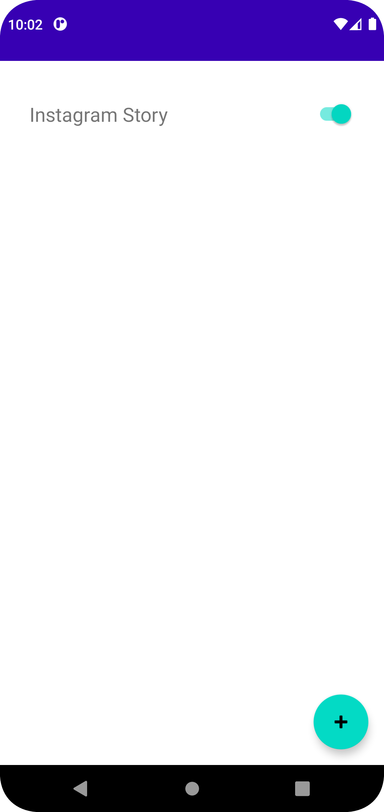
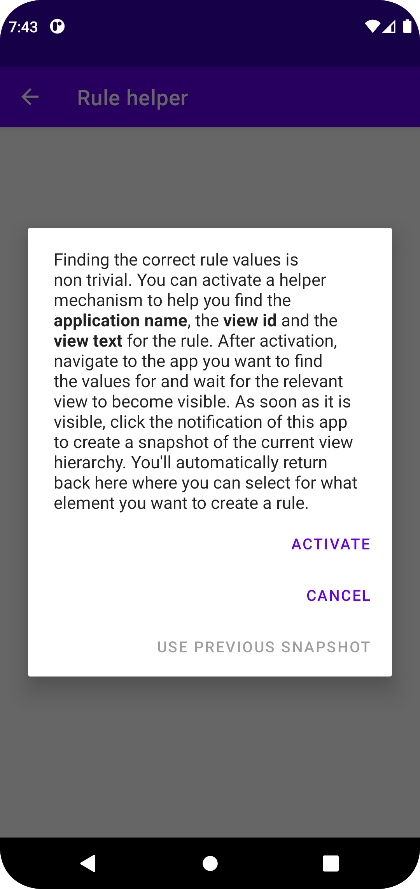
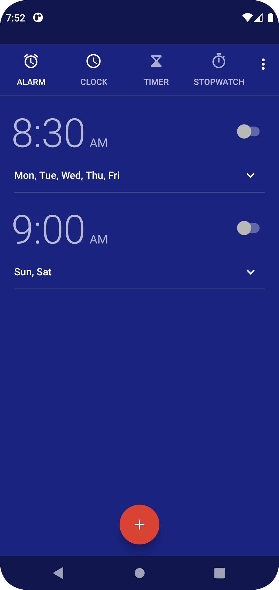
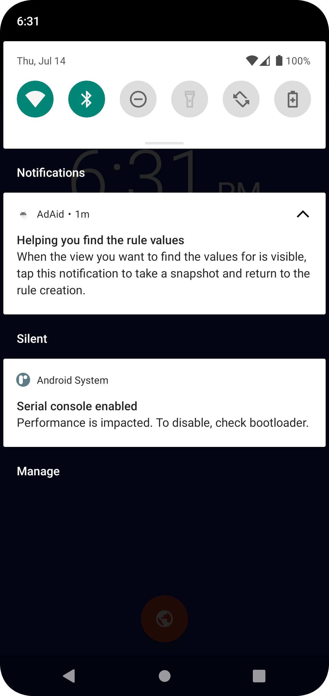
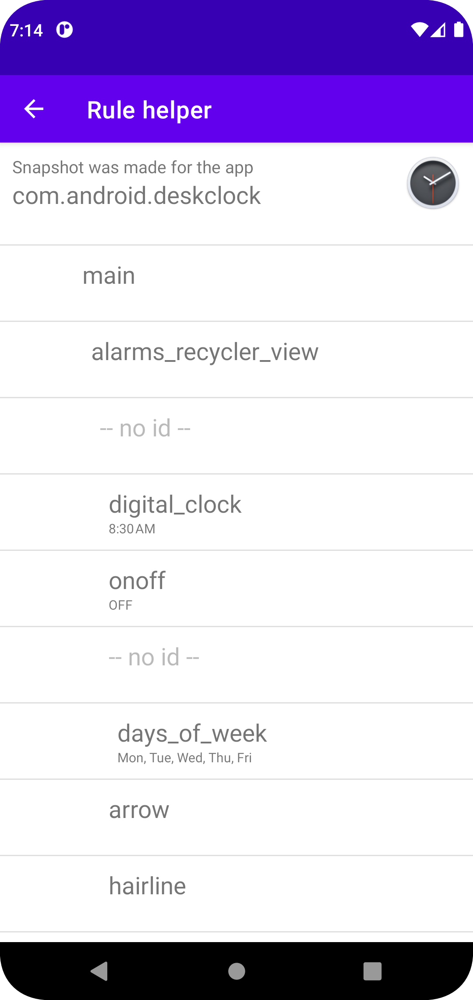

# AdAid - Advertisement Helper
An Ad blocker that works as android accessibility background service and acts on behalf of the user with clicks, swipes or more in other apps.
This was a group projects for the module _BTE5054 - Einstieg in OOP mit Java_. The general goal was to design an arbitrary android app that is build with object oriented principles. The task description (in german) can be found [here](./doc/Miniprojekt_EOOPJ_FS22.pdf). The design documentation (in german) can be found in the [doc](./doc) subfolder. Please note that the documents therein are outdated as the project was extended after the hand-in.

## General Idea
Android allows the creation of accessibility (further called a11y) services. Those have great powers and even can inspect the screen content. This is mainly made for giving feedback to the user by voice or other means. See [Talk Back](https://play.google.com/store/apps/details?id=com.google.android.marvin.talkback) which uses this exact mechanism. The screen content is given to the a11y service as hierarchical node tree of view elements. Those elements have an id, a text content a type and a few other properties.

While learning to program android apps we noticed that many items in android layout xml resources get an id to programmatically access them. Tests showed that the id one chooses for the layout view item is the same id that the a11y service gets in the node tree.

The idea was now born to use these ids to act whenever a certain element is visible on the screen. For example to automatically swipe away instagram reel ads, to mute youtube ads and even click on the button to skip them.

Even though this app its intended for ads its not limited to it. Are you for example using a useful app but it shows an annoying notification sometimes? Are you tired of performing a certain gesture all the time when using an app? AdAid can help with that!

## Requirements
Minimum android SDK is `30` which is Android 11. Most of the features should work on earlier versions of android if compiled for them, but this isn't tested.

## Installation
The latest build of AdAid is generally available as [GitHub release](https://github.com/NikLeberg/AdAid/releases). Download the `AdAid.apk` release asset to your phone and install it. How exactly non Google PlayStore apps can be installed varies from phone to phone. Most of the time opening the `.apk` file in a file manager is enough and will show a dialog box that asks if the app should be installed. Created rules from previous version should still work when updating. Please note that the releases are currently only debug builds.

## Usage
The following paragraphs uses the notion of a _rule_. Rules are a way to customize the actions that this app is taking on behalf of the user. A rule consists of an app that will be controlled, the name of an layout element on screen to search for and an action to take when the given element is visible. More on rules later.

1. Launch app: You see an empty list of rules and a floating action button __+__. Also a notification at the bottom of the screen informs you that the accessibility background service of this app was not enabled yet. [

](./doc/images/screenshot_launch_app_empty.png)
2. Click on _Open settings_ of the notification to be taken to the settings and enable the a11y service that lights up briefly. Note that to work correctly this app needs access to the screen content. As such the permission to do so is requested when you enable the background a11y service. The screen content is only ever processed on device and never gets sent anywhere. This app has no internet connectivity!
3. Return back to the app and click the __+__ button. A new activity starts that lets you create a new rule.
    

    

    
    &nbsp;
    
    

    

4. Fill in the details of the new rule.
    - Name: The name of the rule. Has no effect on the functionality and is only for you to differentiate between different rules.
    - Enabled: Rules can be enabled or disabled. Disabled rules will never trigger an action.
    - Application: Select the application for which the rule should act. The list contains every installed app on your phone. For convenience the app icon is also showed.
    - View id: This is the tricky part. You probably don't have access to the android source code or the layout xml of the app you target. Maybe you could reverse engineer the apk file of it with tools like [dex2jar](https://github.com/pxb1988/dex2jar), [Apktool](https://ibotpeaches.github.io/Apktool/) or [Java Decompiler](https://java-decompiler.github.io/). Since the last update, a helper mechanism is integrated. See next paragraph for its usage.
    - Text to search inside view: Optionally the rule can be made to only trigger when a specific text is found. This is useful when the target view is often visible but not always for _unwanted_ usages like ads. Supports regular expressions. Leave empty to trigger rule always.
    - Action: This is the action the a11y service is performing whenever the rule is triggered. Available are:
        - Swipe (left/right/up/down): Swipes in the given direction over 50% of the screen.
        - Click: Clicks on the nearest element on screen that in clickable.
        - Mute: As long as the triggering view id is found the media output is muted. After its gone, the media is automatically unmuted. If this somehow gets stuck, just press one of the volume buttons to unmute manually.
        - Block: Overlays a black bar over the triggering or a relative (see relative path below) view.
    - Relative path: Optionally you may make the action to act on another view relative to the view that triggered the rule. For example to act on the second child of the grand-parent of the triggering node, enter "p.p.c[2]". The hierarchical display of the further below described rule helper mechanism can help in finding this path. The encoding is as follows, chain them separated with dots:
        - p: move one parent up
        - c[n]: move to nth child (0 indexed)
        - su: move up a sibling
        - sd: move down a sibling
    - Note -> See the list further down for example rules that work.
5. Safe the new rule by clicking on _Save changes_.
6. The initial list of rules is showed again. But this time the list isn't empty but has the newly created rule. [

](./doc/images/screenshot_app_with_instagram_rule.png)
- Tapping on the rule opens an activity to edit it in the same way as when the rule was created.
- To quickly enable or disable rules, use the slider directly shown in the rule list.
- To delete a rule, tap on it and click the bottom _Delete rule_ button.
- All enabled rules are picked up by the background a11y service and triggered when the conditions match.

### Rule Helper
The rule helper is a small helper that allows you to easily create rules. It is accessible by tapping the __?__ button in the top right corner while creating or editing a rule. It helps you to find values for __app name__, __view id__ and __view text__. Because those are non trivial to find with no access to the application sourcecode.
1. Start by editing an existing rule or creating a new one.
2. Tap on the __?__ button in the top right corner.
3. The helper will launch and show you a explanatory dialog. It asks you to confirm the activation of the helper mechanisms with a click on __Activate__. Do so. [

](./doc/images/screenshot_helper_dialog.png)
4. After activation, the AdAid app will minimize itself and bring you back to your home screen. It also creates a notification that when tapping would bring you back to the rule helper. Sometimes, primarily on newer android versions, the notification is not shown. In that case, ensure that __do not disturb__ mode is not enabled and / or check the notification permissions (Something along the lines of `Settings -> Apps -> AdAid -> Manage notifications -> Enable`).
5. Navigate to the app you want to create a rule for. For the sake of this example we will use the Clock app. [

](./doc/images/screenshot_helper_app.png)
6. When the view you want to manipulate and create a rule for is visible, tap on the mentioned notification. In our example we want to automatically enable all alarms i.e. click on the sliders. As the slider is already visible we can open the notification drawer and tap the notification. [

](./doc/images/screenshot_helper_notification.png)
7. The rule helper is brought to the foreground and presents you a list of all views (with id and text) that were visible on screen before the notification was tapped. The hierarchy of the views is represented with an increasing indentation. Not all views have a view id. Those that have none are listed with __--no id--__ and only serve the purpose of representing the hierarchy. [

](./doc/images/screenshot_helper_capture2.png)
8. Select a view from the list and click on it. Selecting could be made with the strategy of looking at the text you saw in the app (for example _Skip Ad_) or for an id that has a meaningful name (for example _skip_ad_button_, [developers seem to be terribly honest :)]). For the Clock example we would choose the view with id _onoff_ as it seems to indicate a slider.
9. After clicking the view in the list, the helper will close and you will be back at the rule edit or creation screen. But now the values for __app name__, __view id__ and __view text__ are filled in. In our example those values would be _com.android.deskclock_, _onoff_ and _OFF_.
- Please note that not all views are represented in the hierarchy the a11y service receives from the android system. This could either be because the app implemented custom views that don't provide the recommended a11y information, or the view was deemed not important for a11y purposes and was left out explicitly by the app developer(s). For example the YouTube app and its new _Shorts_ video content: When instead of an actual short an advertisement is shown, the a11y information is incomplete / sparse and therefore it is not possible to detect and react to that. (Maybe that's intentional, but I don't know.)

### Example Rules
| Name | App | View id | Text | Action | Relative path | Note | See in action |
|---|---|---|---|---|---|---|---|
| Instagram Story | com.instagram.android | reel_viewer_subtitle | `Sponsored.*` | Swipe left |  | Swipes sponsored stories away. | [recording](./doc/videos/instagram_story.mp4) |
| Instagram Reel | com.instagram.android | subtitle_text | `Sponsored.*` | Swipe up |  | Swipes sponsored reels away. |  |
| Instagram Feed | com.instagram.android | secondary_label | `Sponsored.*` | Block | p.sd | Blocks/overlays sponsored content in instagram feed. | [recording](./doc/videos/instagram_feed.mp4) |
| YouTube Click | com.google.android.youtube | skip_ad_button_text | `.*[sS]kip.*` | Click |  | As soon as the ad(s) can be skipped (~5 s) they are skipped. | [recording](./doc/videos/youtube.mp4) |
| YouTube Mute | com.google.android.youtube | ad_progress_text |  | Mute |  | For the duration of ad(s) the media output is muted. |  |

## License
[MIT](LICENSE) © [N. Leuenberger](mailto:leuen4@bfh.ch), [A. Reusser](mailto:reusa1@bfh.ch).
