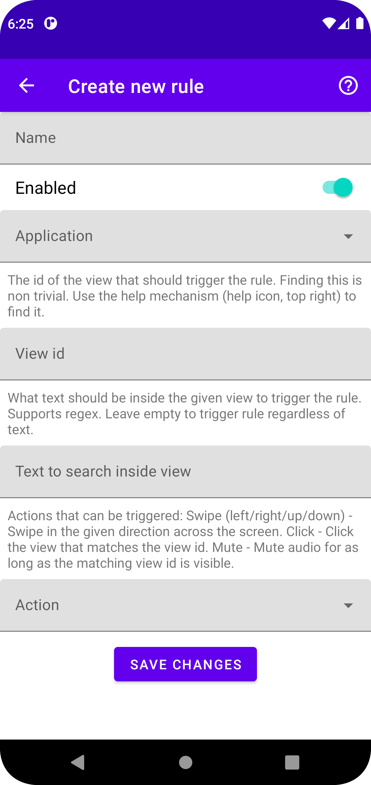

# AdAid - Advertisement Helper
An Ad blocker that works as android accessibility background service and acts on behalf of the user with klicks, swipes or more in other apps.
This was a group projects for the module _BTE5054 - Einstieg in OOP mit Java_. The general goal was to design an arbitrary android app that is build with object oriented principles. The task description (in german) can be found [here](./doc/Miniprojekt_EOOPJ_FS22.pdf). The design documentation (in german) can be found in the [doc](./doc) subfolder.

## General Idea
Android allows the creation of accessibility (further a11y) services. Those have great powers and even can inspect the screen content. This is mainly made for giving feedback to the user by voice or other means. See [Talk Back](https://play.google.com/store/apps/details?id=com.google.android.marvin.talkback) which uses this exact mechanism. The screen content is given to the a11y service as hierarchical node tree of view elements. Those elements have an id, a text content a type and a few other properties.

While learning to program android apps we noticed that many items in android layout xml ressources get an id to programatically access them. Tests showed that the id one chooses for the layout view item is the same id that the a11y service gets in the node tree.

The idea was now born to use these ids to act whenever a certain element is visible on the screen. For example to automatically swipe away instagram reel ads, to mute youtube ads and even click on the button to skip them.

Even though this app its intented for ads its not limited to it. Are you for example using a useful app but it shows an annoying notification sometimes? Are you tired of performing a certain gesture all the time when using an app? AdAid can help with that!

## Requirements
Minimum android SDK is `30` which is Android 11. Most of the features should work on earlier versions of android if compiled for them, but this isnt't tested.

## Installation
ToDo: Make apk available as GitHub release.

## Usage
The following paragraphs uses the notion of a _rule_. Rules are a way to customize the actions that this app is taking on behalf of the user. A rule consists of an app that will be controlled, the name of an layout element on screen to search for and an action to take when the given element is visible. More on rules later.

1. Launch app: You see an empty list of rules and a floating action button __+__. Also a notification at the bottom of the screen informs you that the accessibility background service of this app was not enabled yet. [

](./doc/images/screenshot_launch_app_empty.png)
2. Click on _Open settings_ of the notification to be taken to the settings and enable the a11y service that lights up briefly. Note that to work correctly this app needs access to the screen content. As such the permission to do so is requested when you enable the background a11y service. The screen content is only ever processed on device and never gets sent anywhere. This app has no internet connectivity!
3. Return back to the app and click the __+__ button. A new activity starts that lets you create a new rule. [

](./doc/images/screenshot_create_new_rule.png)
4. Fill in the details of the new rule.
    - Name: The name of the rule. Has no effect on the functionality and is only for you to differentiate between different rules.
    - Enabled: Rules can be enabled or disabled. Disabled rules will never trigger an action.
    - Application: Select the application for whitch the rule should act. The list contains every installed app on your phone. For convenience the app icon is also showed.
    - View id: This is the tricky part. You propably don't have access to the android source code and the layout xml of the app you target. Maybe you could reverse engineer the apk file of it with tools like [dex2jar](https://github.com/pxb1988/dex2jar), [Apktool](https://ibotpeaches.github.io/Apktool/) or (Java Decompiler)[https://java-decompiler.github.io/]. For the future a feature for this app is planned that allows for finding this view ids. For now see the list further down for example rules that work.
    - Text to search inside view: Optionally the rule can be made to only trigger when a specific text is found. this is useful when the target view id is often visible but not always for _unwanted_ usages like ads. Supports regular expressions. Leave empty to trigger rule always.
    - Action: This is the action the a11y service is performing whenever the rule is triggered. Available are:
        - Swipe (left/right/up/down): Swipes in the given direction over 50% of the screen.
        - Click: Clicks on the nearest element on screen that in clickable.
        - Mute: As long as the triggering view id is found the media output is muted. After its gone, the media is automatically unmuted. If this somehow gets stuck, just press one of the volume buttons to unmute manually.
5. Safe the new rule by clicking on _Save changes_.
6. The initial list of rules is showed again. But this time the list isn't empty but has the newly created rule. [

](./doc/images/screenshot_app_with_instagram_rule.png)
- Tapping on the rule opens an activity to edit it in the same way as when the rule was created.
- To quickly enable or disable rules, use the slider directly shown in the rule list.
- To delete a rule, tap on it and click the bottom _Delete rule_ button.
- All enabled rules are picked up by the background a11y service and triggered when the conditions match.

### Example Rules
| Name            | App                        | View id              | Text          | Action     | Note | See in action |
|-----------------|----------------------------|----------------------|---------------|------------|------|---------------|
| Instagram Story | com.instagram.android      | reel_viewer_subtitle | `Sponsored.*` | Swipe left |      | [recording](./doc/videos/instagram.mp4) |
| Instagram Reel  | com.instagram.android      | subtitle_text        | `Sponsored.*` | Swipe up   |      |               |
| YouTube Click   | com.google.android.youtube | skip_ad_button_text  | `.*[sS]kip.*` | Click      |      | [recording](./doc/videos/youtube.mp4) |
| YouTube Mute    | com.google.android.youtube | ad_progress_text     |               | Mute       |      |               |

## License
[MIT](LICENSE) © [N. Leuenberger](mailto:leuen4@bfh.ch), [A. Reusser](mailto:reusa1@bfh.ch).
