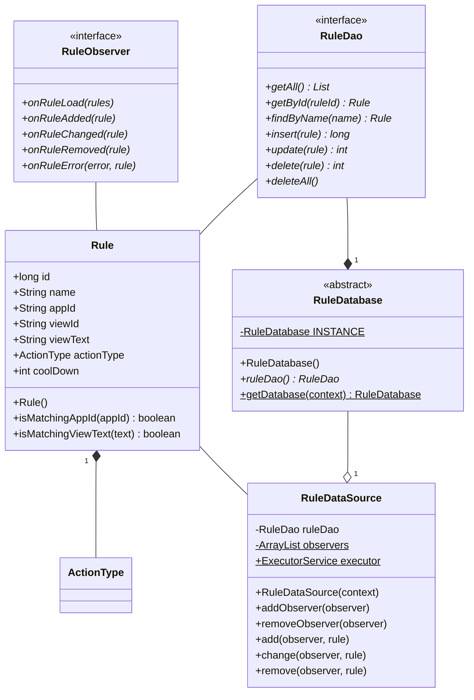
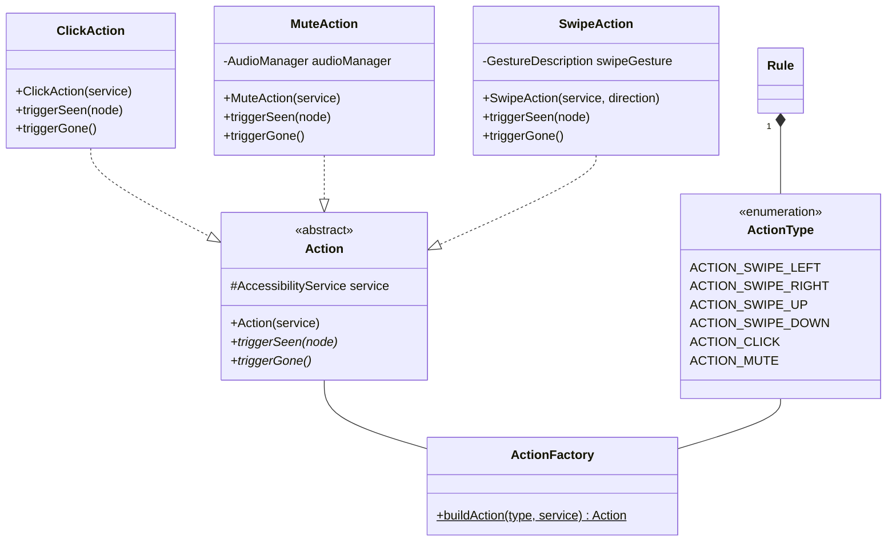
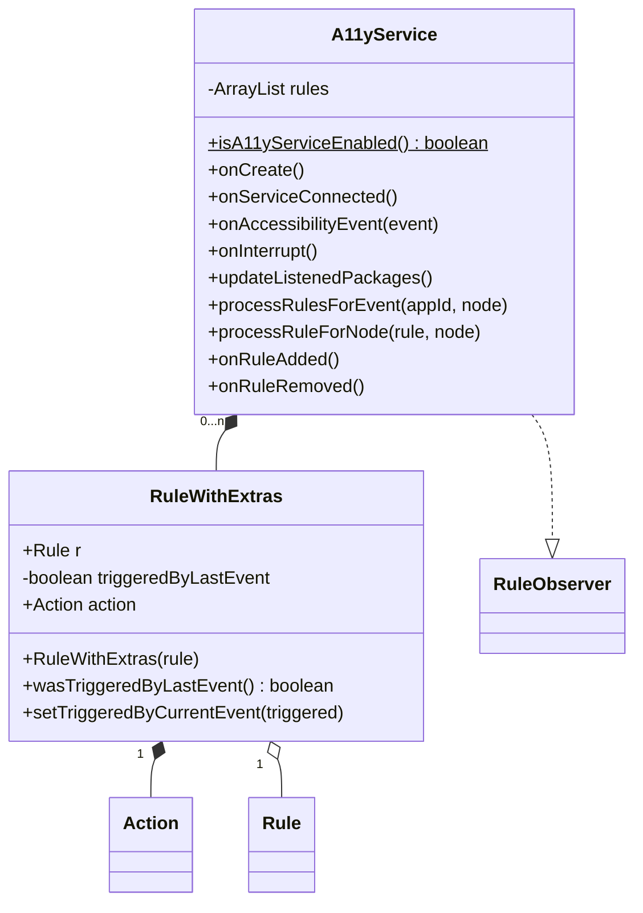
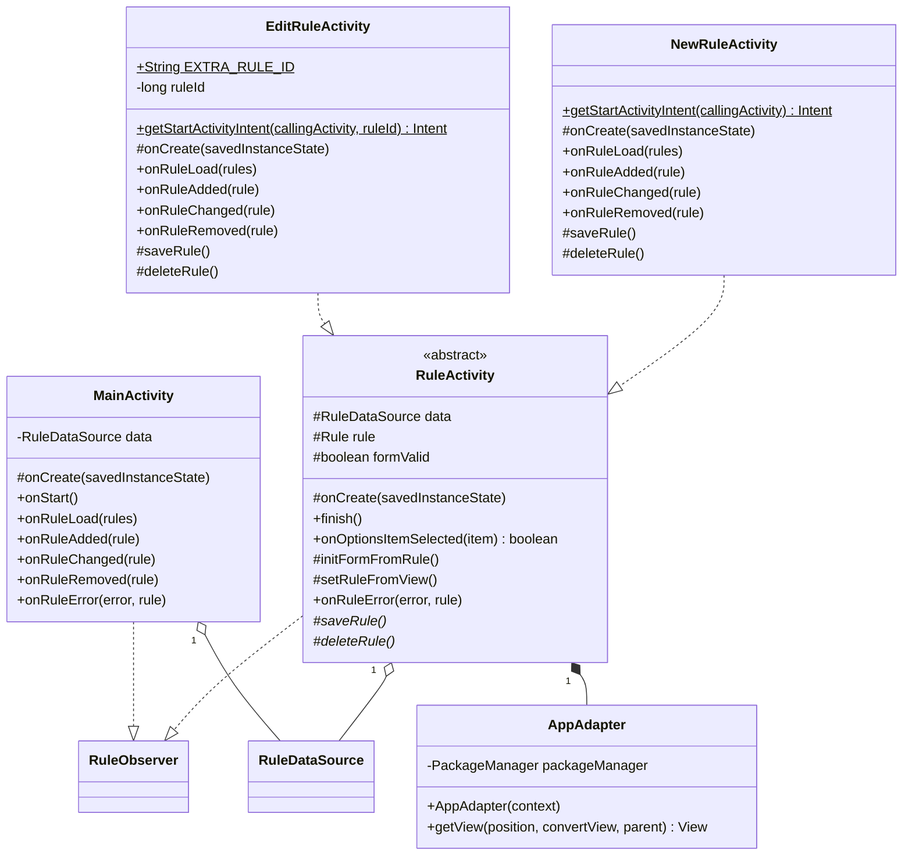
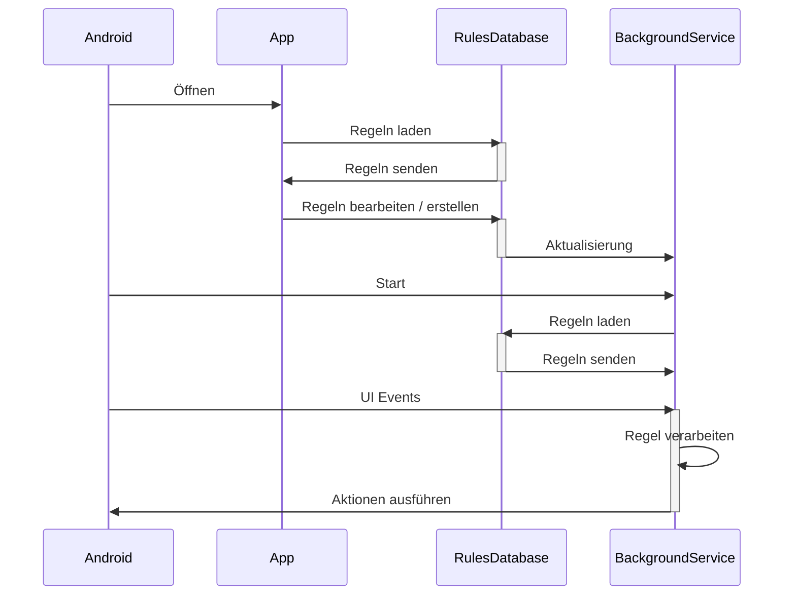
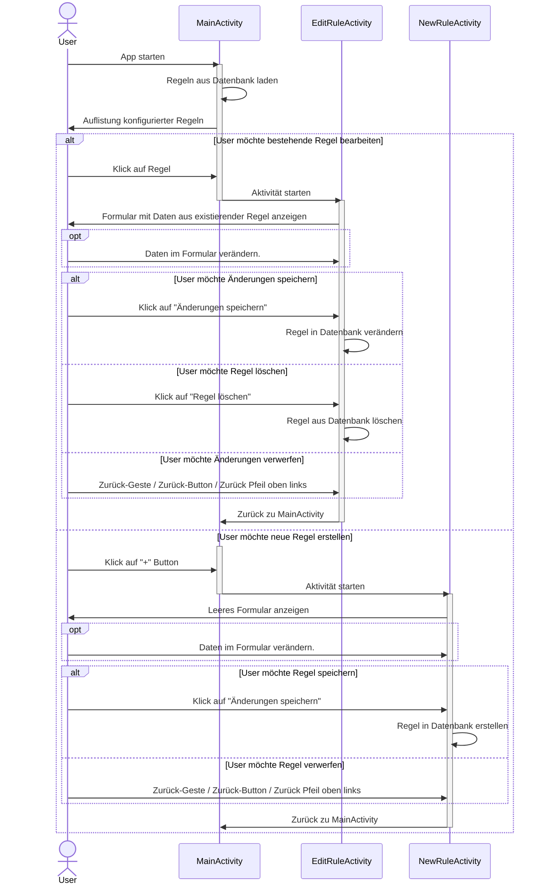
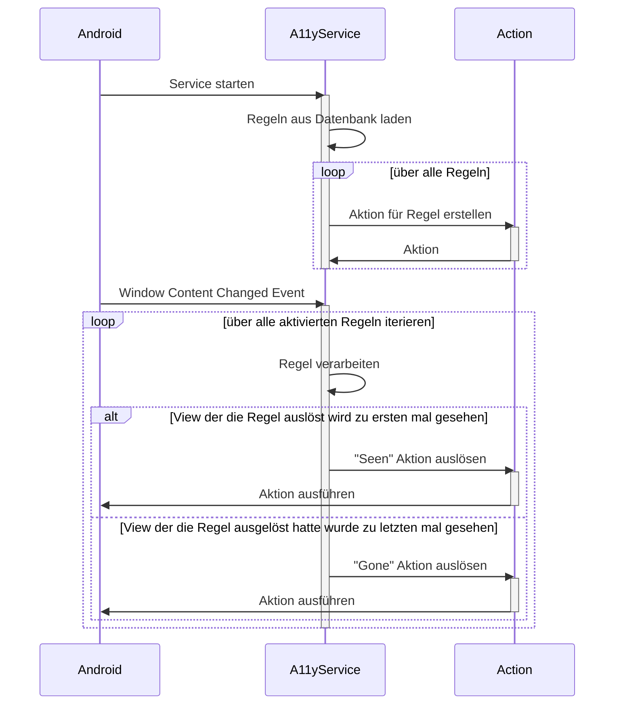

# AdAid - Design

## Klassendiagramme
Im folgenden werden die implementierten Java Klassen in mehreren Klassendiagrammen dargestellt. Die Unterteilung des Klassendiagramms erfolgt auf Package Level und soll die Übersichtlichkeit verbessern. Vererbungen von Android-Framework spezifischen Klassen werden nicht angegeben. Dies aus dem Grund, dass die solchen Klassen sehr komplex im Aufbau sind aber dabei nicht viel zum Klassenverständnis beitragen. 

### Rule & Database

Package: ch.bfh.adaid.db.*

### Action

Package: ch.bfh.adaid.action.*

### Service

Package: ch.bfh.adaid.service.*

### GUI

Package: ch.bfh.adaid.gui.*

## Sequenzdiagramme
Die folgenden Sequenzdiagramme dokumentieren den groben Ablauf der Applikation resp. deren Verhalten. Dabei wird nicht zu sehr ins Detail beschrieben und nur einen konzeptuellen Überblick geschaffen.

### Gesamt
Die abstrakte Gesamtsequenz nach der die Applikation entworfen wurde.

### Benutzerinteraktion
Wie der Benutzer die Applikation bedienen kann.

### Accessibility Service
Wie der A11yService ausgeführt wird.

